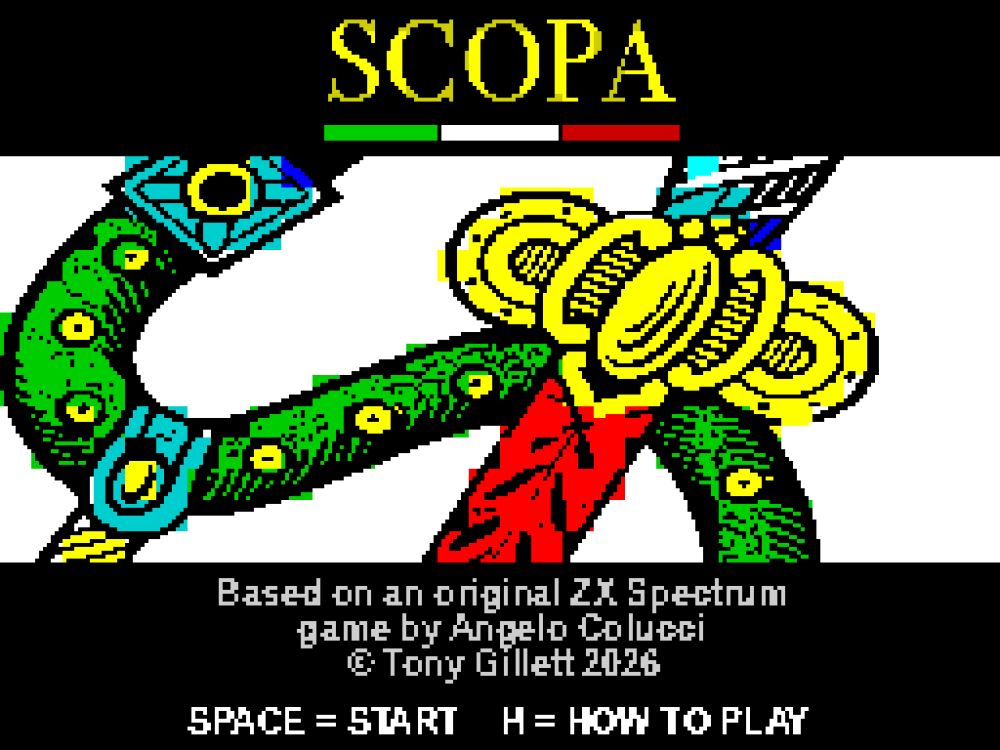
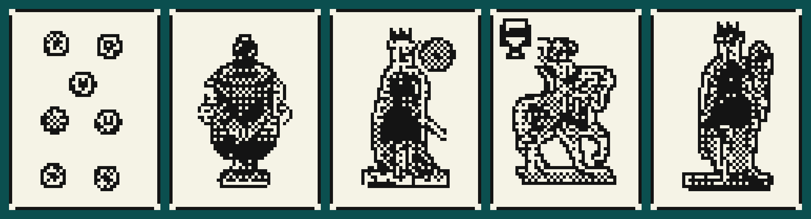
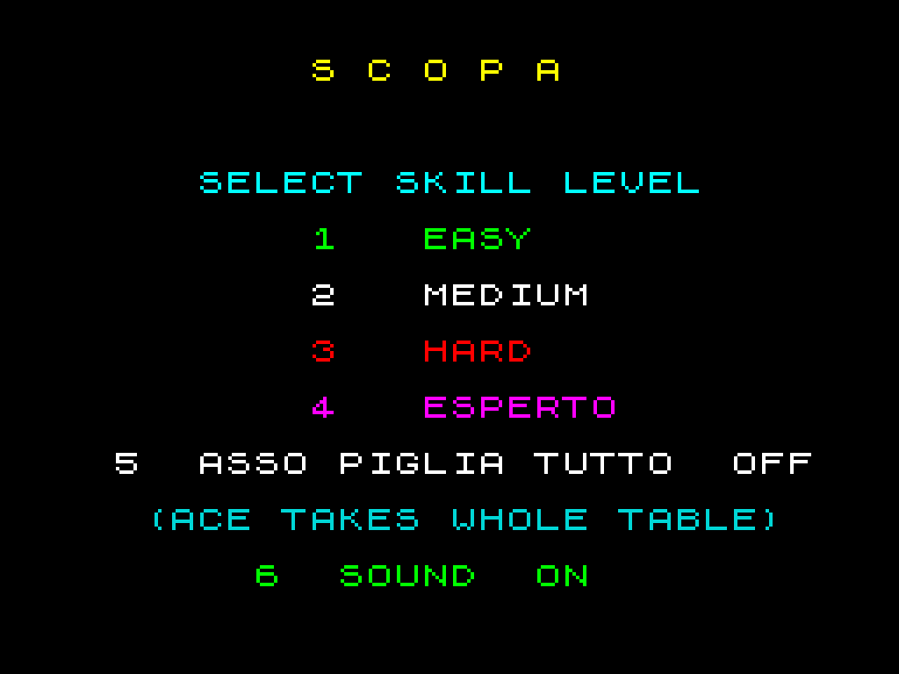
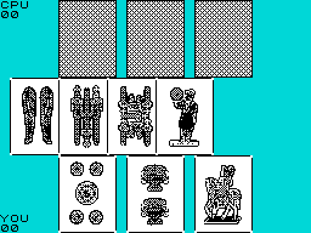
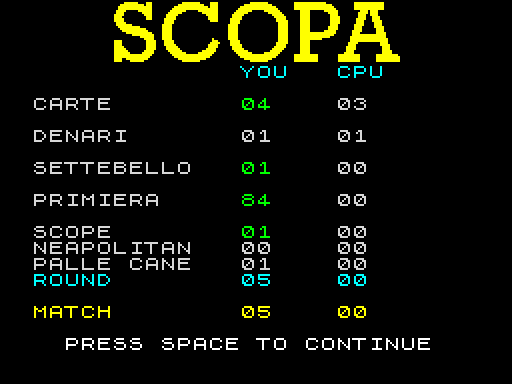

# Scopa for the 48K ZX Spectrum

<p align="center">
  
</p>

A complete implementation of the Italian card game **Scopa**, written in Z80 machine code for
an unmodified 48K Sinclair ZX Spectrum. One player versus the computer, match to 11, **four
difficulty levels** — up to a card-counting AI that plays the endgame *perfectly* — with the
full Neapolitan (Napoletane) deck rendered in defined-monochrome card art.

> *Based on an original ZX Spectrum game by Angelo Colucci* — a friend's game from years ago,
> whose hand-drawn cards were superb and which was lost to time. This is a recreation, built to
> honour it.

**▶ [Play it in your browser](https://scopa-spectrum.gillett-projects.com)** — or load the tape on a real Spectrum.

<p align="center">
  
</p>

## Playing it

Load `scopa.tap` on a real 48K Spectrum or an accurate emulator. It boots from a silent
multi-part tape loader straight to the title screen. `scopa.tzx` is the same tape in the richer
TZX container (byte-identical loading, plus archive metadata — title/author/year). `scopa.sna`
is a snapshot for headless/emulator use.

- **Title screen**: `SPACE` to start, `H` for how-to-play. Leave it idle ~25s and it drops into a
  silent **attract mode** — the computer plays itself (at Esperto) until you press `SPACE`.
- **Skill select**: `1` Easy, `2` Medium, `3` Hard, `4` **Esperto** (card-counting). `5` toggles
  the optional **Asso piglia tutto** rule (default OFF — see below); `6` toggles sound.
- **In play**: `O` / `P` move the cursor over your hand (and cycle capture options when a played
  card can take more than one set); `SPACE` plays / confirms. Your played card stays in your hand
  while you choose which cards to take, so it never hides the table.

<p align="center">
  
  &nbsp;&nbsp;
  
</p>

Match is first to 11 points. Each deal scores **Carte** (most cards), **Denari** (most coins),
**Settebello** (7 of coins), **Primiera** (best card from each suit), one point per **Scopa**
(table sweep), plus the regional **Napola / Neapolitan** and *palle del cane* bonuses.

<p align="center">
  
</p>

### Optional rule: *Asso piglia tutto*

A traditional Neapolitan variation, off by default, toggled with `5` on the skill screen. With it
on, playing an **ace sweeps the whole table** — unless an ace is already on the table (then it
takes only that ace), and an ace on an empty table simply drops. This is the *Scopa d'Assi*
reading, where clearing the table with an ace scores **no** Scopa point.

## The AI

The opponent evaluates **every legal play** — each card in its hand against each way it could
capture, plus simply dropping — and scores each with a weighted value function. The priorities
mirror how Scopa actually scores: the *settebello* and the sevens/sixes (primiera) are prized, a
*scopa* is big, and it weighs grabbing points now against leaving you an easy table.

- **Easy** — greedy: takes the most valuable capture, ignores what it leaves behind.
- **Medium** — adds defence: avoids handing you a sweep or easy matches.
- **Hard** — adds card-counting: it remembers every card already played and pushes harder late in
  a deal.
- **Esperto** ("expert") — the strong one. It counts cards throughout (it never fears a threat it
  can prove you can't hold), and — the key move — once the **deck is exhausted**, the cards it
  hasn't seen *must* be in your hand. So for the final tricks it knows the position exactly and
  searches it with a true **alpha-beta minimax**, playing the endgame optimally. In a head-to-head
  test it beats Hard about **73%** of matches.

It plays **fair**. The AI only ever sees its own hand, the face-up table, and the public record of
cards already played — *never* your hand or the deck order. (Esperto's endgame "knowledge" of your
hand is a deduction any card-counter could make once the deck is empty, not a peek.) The deck is a
Fisher-Yates shuffle seeded at boot.

The base weights aren't guesses: they were **self-play tuned** with `tools/ai_tune.py`, a host-side
simulator that plays tens of thousands of games to search the weight space (only changes that
reproduced across independent runs were kept).

Watching it play (say, in the attract demo) you'll see it do things that look wrong — throw an
ace, drop a coin — that turn out to be right. Its table doctrine, and the case file of every
"surely that's a bug" moment investigated (score so far: machine 6, humans 1), is written up in
[`AI_ANALYSIS.md`](AI_ANALYSIS.md) §9 (anche in italiano: [`AI_ANALYSIS.it.md`](AI_ANALYSIS.it.md)).

## How this was made

The short version: a human who grew up on this machine, and an AI coding partner
([Claude Code](https://claude.com/claude-code)), in a division of labour neither could manage
alone. The AI wrote and debugged every byte of the Z80; the human made every design call — and
was the only one of the pair with eyes on a CRT.

The longer version is a process, and it ran in five acts:

**1. Study the masters.** Before a line of Scopa existed, we learned the machine the hard way
round: reading the classic Spectrum programming canon, then going past the books to the primary
sources — disassembling the greats (*Manic Miner*, *Jet Set Willy*, *Knight Lore*, *Alien 8*,
*Skool Daze*…) to work out exactly how they achieved smooth, flicker-free movement on a machine
with no hardware sprites and no double buffer. Those dives became a private catalogue of
techniques — save-under buffers, delta blits, racing the raster beam, contention-aware cycle
budgets — and that catalogue is all over this game. (The research corpus lives outside this
repo; its fingerprints are in every animation in `scopa.asm`.)

**2. Build the laboratory.** The AI can't reach a Spectrum, so it built itself one: it drives
the ZEsarUX emulator headlessly over its remote-control protocol — assemble, load the tape,
inject a scenario straight into memory, run, then read the screen and the game state back, byte
by byte, to check its own work. The game carries a battery of scripted `TESTMODE` scenarios
(rules edge cases, AI decisions, animation timing) that are verified this way, unattended.

**3. Recreate the game.** Art first — the 40 Neapolitan cards, traced from photographs of a
physical deck into monochrome that respects the Spectrum's 8×8 attribute cells — then the rules
engine, the scoring, the AI opponent, two-voice *Funiculì, Funiculà* on a one-bit speaker, the
animations, the tape loader.

**4. Let the CRT be the judge.** Every significant build went to real hardware and a CRT
television, and the CRT kept catching what no emulator shows: animation tearing ("horizontal
blinds") that a perfect-framerate emulator hides; a one-pixel flashing sliver at the screen's
left edge caused by the ULA's attribute-latch bleed — a genuine hardware artefact no emulator
reproduced; a mid-load pause that desynced real streaming tape players. Fifty-plus refinement
rounds ran on this loop: the AI builds and verifies everything it possibly can, the human
reports back from the glass, and nothing counts as fixed until the CRT says so.

**5. Prove it, don't feel it.** Claims got tests. The opponent's weights were self-play tuned
(above); a watchdog harness then watched the shipped logic play itself across whole matches,
flagging any move a stronger analysis could beat — and every flagged decision was replayed
through the real Z80 code in the emulator to confirm the finding wasn't a harness artefact
(14 out of 14 identical). Deal fairness was proven by exhausting all 8,192 possible RNG seeds.
Even "the player seems to win more often than the computer" was settled properly — with a
40,000-match simulation (it was variance).

The blow-by-blow of all of it — every bug, every dead end, every CRT verdict — is in
[`DEVLOG.md`](DEVLOG.md). The essay-length telling of the story is [`ARTICLE.md`](ARTICLE.md),
and the AI research is written up in [`AI_ANALYSIS.md`](AI_ANALYSIS.md).

## Building

Requires [sjasmplus](https://github.com/z00m128/sjasmplus) and Python 3 (with Pillow, only if
regenerating the art).

```sh
# (optional) regenerate art from the reference card photos — see note below:
python tools/convert_deck.py      # -> deck.bin        (RUN FROM this directory)
python tools/make_screens.py      # -> title.scr, loading.scr, *_banner.bin

# assemble + build the tape (one command):
./build.sh                        # -> scopa.sna (emulator) + scopa.tap + scopa.tzx
# or by hand -- the --sym is REQUIRED (build_tap.py reads loader addresses from scopa.sym,
# and sjasmplus does not refresh the .sym unless asked; build_tap refuses stale inputs):
sjasmplus scopa.asm --sym=scopa.sym
python build_tap.py               # -> scopa.tap
python build_tzx.py               # -> scopa.tzx
```

`TESTMODE` builds run scripted scenarios for headless verification:
`sjasmplus -DTESTMODE=N scopa.asm` (N selects a scenario — rules edge cases, AI choices, the deal
cascade, the Esperto endgame search, etc.; see `DEVELOPMENT.md`).

### Note on the card art

The deck art is **derived** from photographs of a physical Napoletane deck that are *not* included
in this repository. The committed `deck.bin` (and `title.scr` / `loading.scr` / banners) are the
monochrome renderings the game actually ships; the original colour scans live outside the repo, so
`tools/convert_deck.py` won't re-run without them. The art is strictly faithful to that reference
deck.

## Layout

| Path | What |
|------|------|
| `scopa.asm` | The whole game (Z80, sjasmplus) |
| `deck.bin` | 40 cards + 1 back, 384 bitmap bytes each (uncompressed source; built into `deck.zx0`, ZX0-compressed, INCBIN @0xC000 for decode-on-draw) |
| `title.zx0` / `title2.zx0` / `loading.zx0` | Two rotating title screens + the loading screen (ZX0-compressed) |
| `*_banner.zx0` | SCOPA! / NEAPOLITAN / PALLE DEL CANE banners + the scores-screen flag (ZX0) |
| `build_tap.py` / `build_tzx.py` | Build `scopa.tap` (silent multi-part loader) and wrap it as `scopa.tzx` (+ archive metadata) |
| `tools/` | Art pipeline (`convert_deck.py`, `make_screens.py`, `mono_outline.py`) + `ai_tune.py` (host-side AI weight tuner) |
| `site/` | The play-in-browser site (Qaop/JS embed + downloads) |
| `RULES.md` | The rules & scoring system **as implemented** (categories, Primiera/Napola values, variant choices) |
| `DEVELOPMENT.md` | Architecture / memory map / build / gotchas reference |
| `DEVLOG.md` | Chronological build log |
| `ARTICLE.md` | Write-up of how the game was built (anche in italiano: `ARTICLE.it.md`) |

Built and tuned against real hardware on a CRT.
